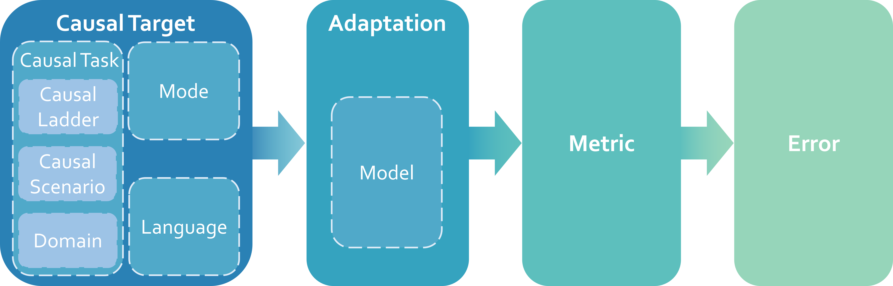
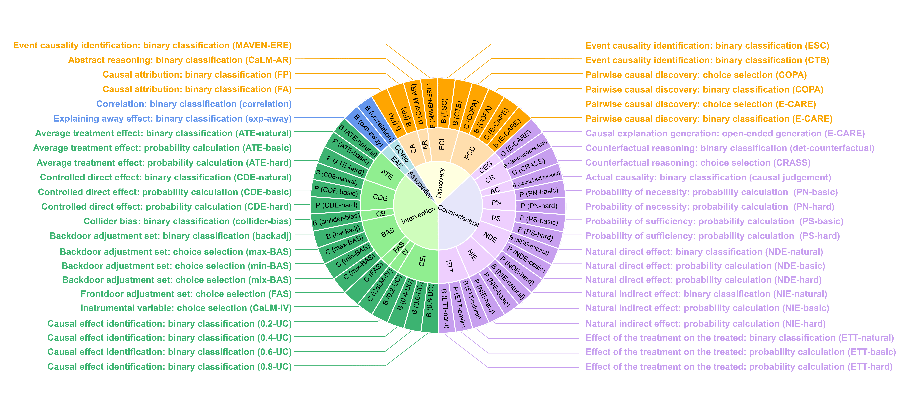

<div align="center">
  
  <br />
  <br />

[🌐 Website](https://opencausalab.github.io/CaLM) |
[📃 Report](https://arxiv.org/abs/2405.00622)| 📧 Welcome to join us by email at causalai@pjlab.org.cn
</div>

# Causal Evaluation of Language Models (CaLM)

We introduce **Ca**usal evaluation of **L**anguage **M**odels (CaLM), which, to the best of our knowledge, is the first
comprehensive benchmark for evaluating the causal reasoning capabilities of language models. The CaLM framework establishes a foundational taxonomy consisting of four modules: causal target (i.e., what to evaluate), adaptation (i.e., how to obtain the results), metric (i.e., how to measure the results), and error (i.e., how to analyze the bad results).

<div align="center">

</div>

## 📣 News
[2024.5.1] Causal Evaluation of Language Models (CaLM) is released, including technical report, evaluation dataset and codebase.

## 🤩 Participate by Submitting Your Results!
We invite you to contribute to our project by submitting your model-generated results. Please refer to our [submission guideline](https://opencausalab.github.io/CaLM/calm_website/pages/submit.html) to ensure your submissions are processed efficiently. Additionally, we welcome contributions such as new models, prompts, datasets, and metrics. Contact us at causalai@pjlab.org.cn for more information.

## ⌨️ Quick Start
### installation
```
git clone https://github.com/OpenCausaLab/CaLM.git
conda create -n calm python=3.8
conda activate calm
pip install -r requirements.txt
```
### Run Models and Save Results
First, download the model you want to run if it is open-source, or obtain the API key if the model is limited. Then put the dir or the api key of your model to model_configs, you can choose to put the dir or api key to default.json or create a file named `{model}.json`. We specify the model details and where to download the open-source models in [model details](documents/model_details.md).

```
python calm/run.py --models vicuna_33b -p zero-shot-IcL -t PCD-B_E-CARE_EN  -mcfg ./model_configs -d ./calm_dataset -o ./output
```
#### Required Arguments
- `-m`, `--models`
  - **Description**: Specify the model names to be executed. Models should be separated by spaces.
  - **Example**: `-m vicuna_33b gpt4 baichuan1_7b`
- `-p`, `--prompt-styles`
  - **Description**: Select prompt styles from a predefined list that includes variations in different languages.
  - **Choices**: `-p basic`
- `-t`, `--tasks`
  - **Description**: List of causal tasks to be executed.
  - **Example**: `-t BAS-C_min-BAS_EN CDE-P_CDE-hard_EN`
#### Optional Arguments
- `-mcfg`, `--model-configs-root`
  - **Description**: Defines the path for model configs. These configurations specify the exact settings while running the target models. Configuration files should be named `{model}.json`. Notice that the maximum new tokens in the config represent the maximum tokens output by the model. 
  - **Default**: `./model_configs`
- `-d`, `--dataset-root`:
  - **Description**: Path to the directory containing task datasets.
  - **Default**: `./calm_dataset`
- `-o`, `--output-root`:
  - **Description**: Directory where model response outputs will be saved.
  - **Default**: `./output`
- `-r`, `--resume`:
  - **Description**: Enables resuming from the last uncompleted output file, if it exists.
  - **Action**: `store_true`

### Evaluate Results
```
python calm/evaluate.py --models vicuna_33b -p zero-shot-IcL -t PCD-B_E-CARE_EN -cm -ea -am -d ./calm_dataset -gt ./calm_dataset_gt_label -o ./output
```
#### Required Arguments
- `-m`(`--models`), `-p`(`--prompt-styles`), and `-t`(`--tasks`) are similar as those in `run.py`.
#### Optional Arguments
- `-cm`, `--core-metrics`
  - **Description**: Enables the computation and storage (by CSV) of core metrics (accuracy, robustness) using the provided ground truth dataset. If you possess the ground truth dataset label, you can evaluate the core metrics using this argument. If you do not have the ground truth dataset, you can not use `-cm` nor `-am`, you can only evaluate errors using `-ea`. Note that robustness metrics are not applicable for tasks other than adversarial.
  - **Action**: store_true
- `-ea`, `--error-analysis`
  - **Description**: Enables error analysis to assess the performance and identify potential issues. The results will be saved in CSV. Note that error analysis does not include the explicit-function prompt styles and CEG tasks.
  - **Action**: store_true
- `-am`, `--aggregate-metrics`
  - **Description**: Enables the computation of aggregate metrics, based on core metrics data. The results will be saved in CSV. If you have multiple running results (responses.json), you can use this argument. You need to have the corresponding core metric result first; if you do not have the core metric result, remember to use `-am` along with `-cm` to enable core metric computation and storing first. For open-ended tasks (causal_explanation_generation and probability computation tasks such as PS-P_PS-basic_CN, NIE-P_NIE-basic_EN), we define the understandability manually, so it is not dependent on the metric computation script here; however, you can still use `-am` to operate on and see other statistics.
  - **Action**: store_true
- `--check-complete`
  - **Description**: Checks whether the task dataset is run completely, raises an error if not.
  - **Action**: store_true
- `-d`, `--dataset-root`
  - **Description**: Path to the directory containing task datasets. It is used for checking whether the dataset is run completely, so it is required if `--check-complete` is used.
  - **Default**: ./calm_dataset
- `-gt`, `--gt-label-root`
  - **Description**: Directory containing the ground truth labels necessary for computing core metrics.
  - **Default**: ./calm_dataset_gt_label
- `-o`, `--output-root`
  - **Description**: Directory where model response outputs to be evaluated were saved.
  - **Default**: ./output

For model developers, kindly reach out to us by email at causalai@pjlab.org.cn for your own models' evaluation requirements; we need the generated JSON files of model response (responses.json) for evaluation. We will communicate with you within three days and send the evaluation results later. For more details, refer to our [submission guideline](https://opencausalab.github.io/CaLM/calm_website/pages/submit.html).
## 🖌️ Available Models
Currently, we support the following 18 models. You can use them by entering their corresponding API names after `-m`, `--models` in the command line. Note that models such as ada (0.35B), babbage (1.3B), curie (6.7B), and davinci (175B) are excluded as their api are no longer supported by OpenAI.
- baichuan1_7b (Baichuan1 (7B))
- baichuan1_chat_13b (Baichuan1-chat (13B))
- baichuan2_chat_7b (Baichuan2-chat (7B))
- baichuan2_chat_13b (Baichuan2-chat (13B))
- claude2 (Claude2)
- chatgpt (GPT-3.5-Turbo)
- gpt4 (GPT-4)
- internlm_chat_20b (InternLM-chat (20B))
- internlm_chat_7b (InternLM-chat (7B))
- koala_13b (Koala (13B))
- qwen_7b (Qwen (7B))
- qwen_14b (Qwen (14B))
- llama2_7b (Llama2 (7B))
- llama2_13b (Llama2 (13B))
- llama2_70b (Llama2 (70B))
- llama2_chat_70b (Llama2-chat (70B))
- vicuna_33b (Vicuna-v1.3 (33B))
- wizardcoder_15b (Wizardcoder (15B))

To add your model, please submit a pull request and email us at causalai@pjlab.org.cn. For details on adding models to our benchmarks, see [model details](documents/model_details.md).
## 🗄️ Available Datasets (Causal Tasks)


We provide 92 datasets for causal evaluation, stored in the `calm_dataset` folder. The directory structure is:
```
├── README.md
├── LICENSE
├── calm_dataset
| ├── causal_discovery # Rung of the causal ladder
| │ ├── abstract_reasoning # Causal scenario
| │ │ ├── AR-B_(CaLM-AR)_CN.json # Causal task
| │ | └── AR-B_(CaLM-AR)_EN.json # Causal task
| │ └── ...
| └── ...
├── calm # calm packages
└── ...
```
Each dataset represents a specific causal target in either English or Chinese. For an overview of the datasets, see [tasks](documents/tasks.md).

Note: The task dataset containing the word "natural" is identical to its corresponding task dataset containing the word "basic", e.g., "NDE-B_NDE-natural_CN" and "NDE-P_NDE-basic_CN" have the same content. We split them into two files for user convenience during running and evaluation.

We support the ground truth (GT) labels for public datasets with references, but keep our own dataset's GT labels unreleased for further use. If you want to evaluate your model on the whole dataset, kindly reach out to us by email at causalai@pjlab.org.cn. We will reply in 3 days. The `responses.json` files generated by your model will be required. For details, see [submission guideline](https://opencausalab.github.io/CaLM/calm_website/pages/submit.html).

If you want to add your own dataset, please submit a pull request and email us at causalai@pjlab.org.cn.

## 🔉 Available Prompt Styles (Adaptation)
For prompts in English (default), we use names such as basic, zero-shot-IcL. For prompt in Chinese, we add "-CN" to the prompt name, such as basic-CN, zero-shot-IcL-CN.

Supported prompt styles for most tasks include:
- basic, basic-CN, 
- adversarial-ignore, adversarial-ignore-CN, adversarial-doubt, adversarial-doubt-CN, 
- zero-shot-IcL, zero-shot-IcL-CN, one-shot-IcL, one-shot-IcL-CN, three-shot-IcL, three-shot-IcL-CN, 
- zero-shot-CoT, zero-shot-CoT-CN, 
- manual-CoT, manual-CoT-CN, 
- explicit-function, explicit-function-CN.

For certain tasks (ATE, CDE, ETT), due to token limitations, we removed three-shot-IcL-CN, resulting in the following supported prompts:
- basic, basic-CN, 
- adversarial-ignore, adversarial-ignore-CN, adversarial-doubt, adversarial-doubt-CN, 
- zero-shot-IcL, zero-shot-IcL-CN, one-shot-IcL, one-shot-IcL-CN, three-shot-IcL, 
- zero-shot-CoT, zero-shot-CoT-CN, 
- manual-CoT, manual-CoT-CN, 
- explicit-function, explicit-function-CN. 

For NIE, NDE, PN, PS tasks, we deleted the three-shot-IcL-CN and replace the three-shot-IcL to two-shot-IcL, so the supported prompts are: 
- basic, basic-CN, 
- adversarial-ignore, adversarial-ignore-CN, adversarial-doubt, adversarial-doubt-CN, 
- zero-shot-IcL, zero-shot-IcL-CN, one-shot-IcL, one-shot-IcL-CN, two-shot-IcL, 
- zero-shot-CoT, zero-shot-CoT-CN, 
- manual-CoT, manual-CoT-CN, 
- explicit-function, explicit-function-CN.

We welcome contributions to add new prompt styles via pull requests. Remember to further inform us at causalai@pjlab.org.cn.

## 📊 Available Metric and Errors
Currently we support the evaluation scripts for 7 metrics and 5 quantitative errors. 

### Metrics
- **Accuracy (Model)** This metric measures the correctness of the model’s responses
across various prompts, serving as a fundamental measure of its effectiveness.
- **Robustness (Model)** This metric evaluates
the model’s stability when faced with adversarial inputs or disturbances, highlighting its reliability under
challenging conditions.
- **Model volatility (Model)** This metric assesses the consistency of a model’s performance when
exposed to different prompting strategies, indicating its predictability and reliability across prompts.
- **Understandability (Causal Task)** This metric examines the extent to which
models comprehend and effectively perform on specified causal scenarios or causal tasks.
- **Open-Limited Gap (Causal Task)** This metric quantifies the performance disparity between open-access and limited-access models within a causal
scenario. 
- **Solvability (Causal Task)** This metric indicates the relative difficulty of a causal scenario, derived from the performance
of models and model-prompt combinations.
- **Prompt volatility (Prompt)** This metric measures the variability in model performance
across different prompting strategies for a specific causal scenario.
### Errors 
- **Same response to all questions** This type of error refers to cases where the model consistently produces the same answer regardless of the specific question posed.
- **Empty response** This type of error refers to instances where the model generates a blank response.
- **Limitation of instruction-following** This type of error refers to situations where the model fails to provide a standard response according to the instructions given in the question.
- **Repetition** This type of error, characterized by the model fabricating responses and repeating questions within replies, presents significant challenges to our evaluation process. 
- **Language inconsistency** This issue arises when a question posed in one language elicits a response that includes text in the other language. 

We welcome contributions of new metrics or error types through pull requests. Please also email us at causalai@pjlab.org.cn to submit your pull request.

# 🖇️ Citation
```
@misc{chen2024causal,
      title={Causal Evaluation of Language Models}, 
      author={Sirui Chen and Bo Peng and Meiqi Chen and Ruiqi Wang and Mengying Xu and Xingyu Zeng and Rui Zhao and Shengjie Zhao and Yu Qiao and Chaochao Lu},
      year={2024},
      eprint={2405.00622},
      archivePrefix={arXiv},
      primaryClass={cs.CL}
}
```
